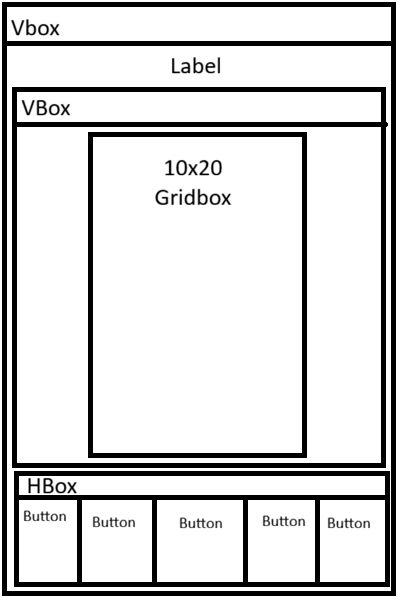

# Final Project GUI
My final project is gonna be some simple game like Tetris. You can use the buttons on the bottom to move boxes in the Gridbox.
## Final Project Description
Gridbox where Tertiminos are placed and can move

## GUI Wireframe

